# vscode-theme<!-- omit in toc -->
VSCode の UI カラーテーマを、ワークスペース（`.vscode/settings.json`）またはグローバル設定に適用する小さなコマンドラインスイッチャーです。既存の `workbench.colorCustomizations` は自動でバックアップされ、リセット時にはきれいに復元されます。

ダーク系・ライト系のテーマを標準で同梱しています（[.vscode-themes/](.vscode-themes/)）。ティールのアクセントを共有する Catppuccin インスパイアのダーク／ライトペア（`frappe-teal` / `dawn-teal`）も含まれています。任意の `<name>.json` をテーマディレクトリに置くだけで追加できます。

> English version: [README.md](README.md)

---

- [テーマプレビュー](#テーマプレビュー)
- [ワークスペースの識別マーカーとしてのテーマ活用](#ワークスペースの識別マーカーとしてのテーマ活用)
- [インストール](#インストール)
  - [macOS / Linux（bash / zsh）](#macos--linuxbash--zsh)
  - [Windows（PowerShell）](#windowspowershell)
- [使い方](#使い方)
- [仕組み](#仕組み)
- [ファイル構成](#ファイル構成)
- [バージョン](#バージョン)
  - [バージョンの伝わり方](#バージョンの伝わり方)

## テーマプレビュー

<style>
.vsc-card .sb-item { cursor: pointer; transition: background .08s ease, color .08s ease; }
.vsc-card .sb-item:not(.sb-active):hover { background: var(--hvr-bg); color: var(--hvr-fg); }
.vsc-card .tab-inactive { cursor: pointer; transition: background .08s ease, color .08s ease; }
.vsc-card .tab-inactive:hover { background: var(--hvr-bg); color: var(--hvr-fg); }
</style>

### A &mdash; Navy + orange<!-- omit in toc -->


> ダークネイビーの背景にオレンジのアクセント。


<div align="center">
  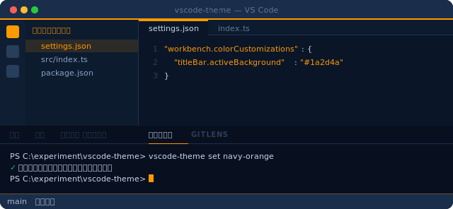
</div>

**テーマ名:** `navy-orange`  
**アクセント:** `#FF9900` &middot; **背景:** `#0a1628` &middot; **タイトルバー:** `#1a2d4a`

---

### B &mdash; Squid ink + yellow<!-- omit in toc -->


> 深いスクイッドインク（イカ墨）色の背景にゴールドイエローのアクセント。


<div align="center">
  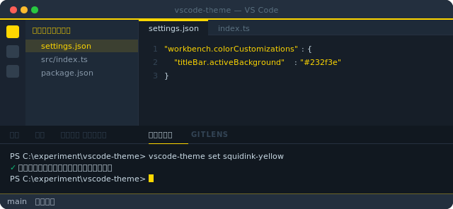
</div>

**テーマ名:** `squidink-yellow`  
**アクセント:** `#FFD700` &middot; **背景:** `#161e28` &middot; **タイトルバー:** `#232f3e`

---

### C &mdash; Bedrock teal<!-- omit in toc -->


> ダークティールの背景にシアングリーンのアクセント。


<div align="center">
  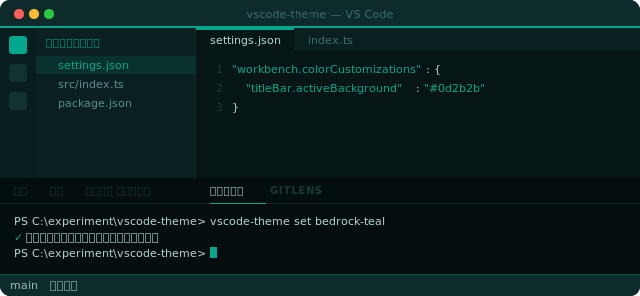
</div>

**テーマ名:** `bedrock-teal`  
**アクセント:** `#01A88D` &middot; **背景:** `#061616` &middot; **タイトルバー:** `#0d2b2b`

---

### D &mdash; Dark + ember red<!-- omit in toc -->


> 非常に暗い背景にエンバー（残り火）レッドのアクセント。他のウィンドウと見間違えようのない配色。


<div align="center">
  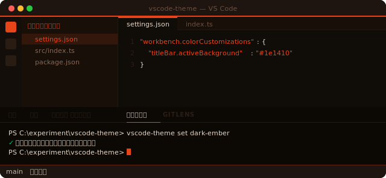
</div>

**テーマ名:** `dark-ember`  
**アクセント:** `#E8441A` &middot; **背景:** `#100c08` &middot; **タイトルバー:** `#1e1410`

---

### E &mdash; Forest green<!-- omit in toc -->


> 深い森林色の背景に、鮮やかなスプリンググリーンのアクセント。


<div align="center">
  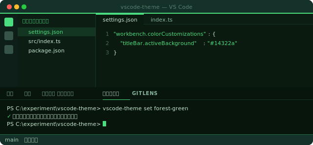
</div>

**テーマ名:** `forest-green`  
**アクセント:** `#4ADE80` &middot; **背景:** `#0a1a0f` &middot; **タイトルバー:** `#14322a`

---

### F &mdash; Royal purple<!-- omit in toc -->


> ダークプラム（濃い紫）の背景に、深いバイオレットのアクセント。


<div align="center">
  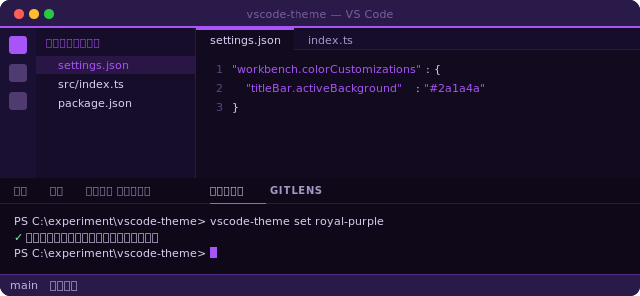
</div>

**テーマ名:** `royal-purple`  
**アクセント:** `#A855F7` &middot; **背景:** `#120a1f` &middot; **タイトルバー:** `#2a1a4a`

---

### G &mdash; Ocean blue<!-- omit in toc -->


> 深海色の背景に、明るいスカイシアンのアクセント。


<div align="center">
  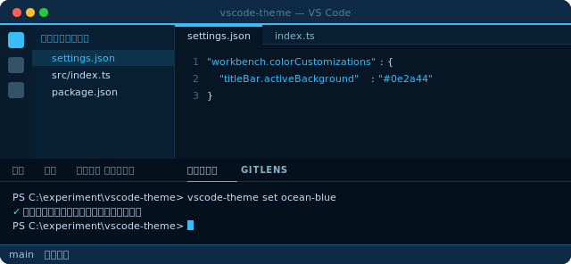
</div>

**テーマ名:** `ocean-blue`  
**アクセント:** `#38BDF8` &middot; **背景:** `#061624` &middot; **タイトルバー:** `#0e2a44`

---

### H &mdash; Rose magenta<!-- omit in toc -->


> ダークワイン色の背景に、ホットピンク寄りのマゼンタのアクセント。


<div align="center">
  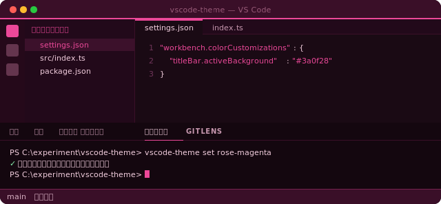
</div>

**テーマ名:** `rose-magenta`  
**アクセント:** `#EC4899` &middot; **背景:** `#1a0a14` &middot; **タイトルバー:** `#3a0f28`

---

### I &mdash; Paper light<!-- omit in toc -->


> 温かみのあるクリーム色の紙の背景に、セピアブラウンのアクセント。昼間のコーディング向けのライトテーマ。


<div align="center">
  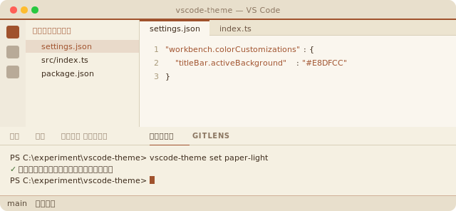
</div>

**テーマ名:** `paper-light`  
**アクセント:** `#A0522D` &middot; **背景:** `#FAF6EE` &middot; **タイトルバー:** `#E8DFCC`

---

### J &mdash; Arctic light<!-- omit in toc -->


> 冷たいフロストホワイトの背景に、シャープなスチールブルーのアクセント。コントラスト控えめのライトテーマ。


<div align="center">
  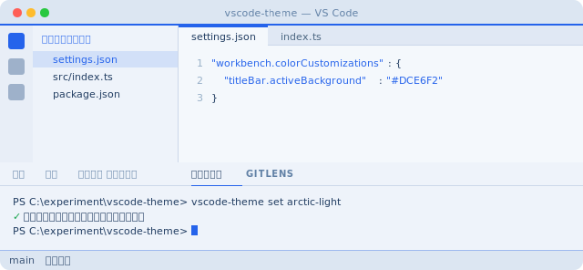
</div>

**テーマ名:** `arctic-light`  
**アクセント:** `#2563EB` &middot; **背景:** `#F4F8FC` &middot; **タイトルバー:** `#DCE6F2`

---

### K &mdash; Frappé teal<!-- omit in toc -->


> Catppuccin Frappé にインスパイアされたダークテーマ。鮮やかなティールアクセント。`dawn-teal` とペアで使うことを想定したダーク／ライトセット。


<div align="center">
  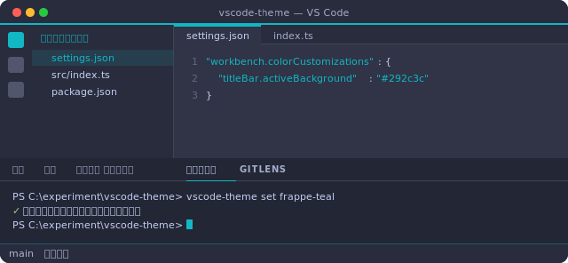
</div>

**テーマ名:** `frappe-teal`  
**アクセント:** `#11B7C5` &middot; **背景:** `#303446` &middot; **タイトルバー:** `#292c3c`

---

### L &mdash; Dawn teal<!-- omit in toc -->


> Rosé Pine Dawn にインスパイアされたライトテーマ。明るいクリーム色の背景に深いティールのアクセント。`frappe-teal` のライト版カウンターパート。


<div align="center">
  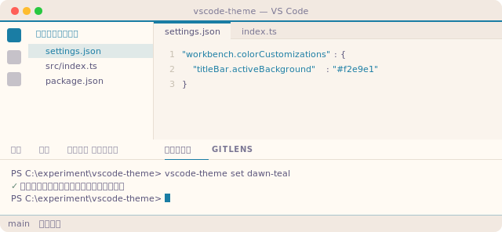
</div>

**テーマ名:** `dawn-teal`  
**アクセント:** `#1A7DA4` &middot; **背景:** `#faf4ed` &middot; **タイトルバー:** `#f2e9e1`

---

## ワークスペースの識別マーカーとしてのテーマ活用

各テーマはタイトルバー・アクティビティバー・ステータスバーを強いアクセント色で塗るため、複数の VSCode ウィンドウを並べたときの「**視覚的な環境タグ**」として使えます。今見ているのが本番・ステージング・作業用スクラッチパッドのどれなのか、一目で分かるようになります。既定値はグローバルに適用し、プロジェクトフォルダ内で `vscode-theme set <name>` を実行すればワークスペース単位で上書きできます。

用途のマッピング例：

| 用途                             | テーマ                               | 理由                                                                                     |
| -------------------------------- | ------------------------------------ | ---------------------------------------------------------------------------------------- |
| **本番 / 危険ゾーン**            | `dark-ember`                         | エンバーレッドは「ここでは慎重に」という感覚。                                           |
| **ステージング / pre-prod**      | `squidink-yellow`                    | ゴールド＝注意、ただし停止ではない。                                                     |
| **開発**                         | `forest-green` または `bedrock-teal` | グリーン＝安全、進んで OK。                                                              |
| **個人 / サイドプロジェクト**    | `royal-purple` または `rose-magenta` | 仕事のウィンドウと明確に区別。                                                           |
| **クラウド / インフラ作業**      | `navy-orange` または `ocean-blue`    | 長時間のインフラ作業に適したクール系トーン。                                             |
| **ドキュメント / 執筆 / 昼光下** | `paper-light` または `arctic-light`  | 読む作業が多いときや明るい部屋ではライトテーマを。                                       |
| **連動するダーク／ライトペア**   | `frappe-teal` + `dawn-teal`          | ティールのアクセントを共有。周囲の明るさで切り替えても視覚的アイデンティティは保たれる。 |
| **長時間作業 / 目に優しい**      | `sage-paper` + `sage-paper-dark`     | ブルーライトを抑えた暖色パレットで長時間のセッション向け。時間帯で切り替える運用に。     |

これはあくまで慣例です。色と意味の対応付けは自分にとって自然なものを選んでください。ツール側で強制しているわけではありません。

---

### M &mdash; レザーオレンジ<!-- omit in toc -->


> サドルレザーのようなブラウンに、深いバーントオレンジのアクセント。


<div align="center">
  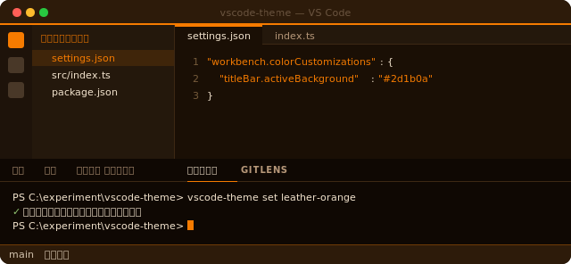
</div>

**テーマ名:** `leather-orange`
**アクセント:** `#F67B00` &middot; **背景:** `#1a0f05` &middot; **タイトルバー:** `#2d1b0a`

---

### N &mdash; ココアゴールド<!-- omit in toc -->


> 温かみのあるココアブラウン地に、アンティークゴールドのアクセント。


<div align="center">
  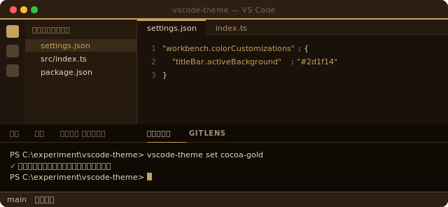
</div>

**テーマ名:** `cocoa-gold`
**アクセント:** `#C5A260` &middot; **背景:** `#1a120a` &middot; **タイトルバー:** `#2d1f14`

---

### O &mdash; エスプレッソグリーン<!-- omit in toc -->


> 温かなクリーム地にディープなエスプレッソグリーンのアクセント。


<div align="center">
  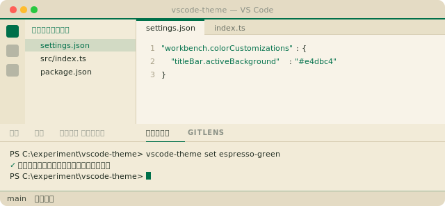
</div>

**テーマ名:** `espresso-green`
**アクセント:** `#00704A` &middot; **背景:** `#f8f3e8` &middot; **タイトルバー:** `#e4dbc4`

---

### P &mdash; マウンテンサンセット<!-- omit in toc -->


> 夕暮れの山並みと空色のグラデーションを映す、ピーチのサンセットアクセント。


<div align="center">
  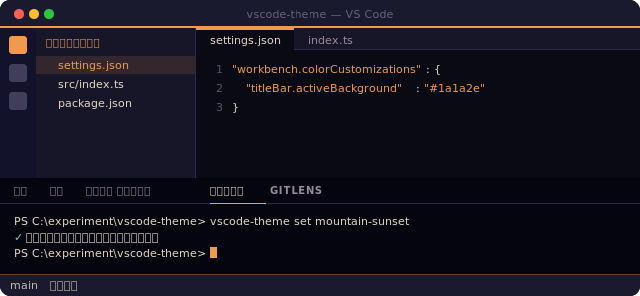
</div>

**テーマ名:** `mountain-sunset`
**アクセント:** `#F19A4D` &middot; **背景:** `#0a0a14` &middot; **タイトルバー:** `#1a1a2e`

---

### T &mdash; コバルト + クリムゾン<!-- omit in toc -->


> 深いコバルトブルーに鮮やかなクリムゾンのアクセント。原色の高コントラストな存在感。


<div align="center">
  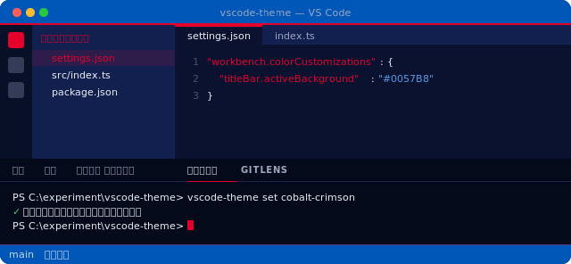
</div>

**テーマ名:** `cobalt-crimson`
**アクセント:** `#E4002B` &middot; **背景:** `#0a1230` &middot; **タイトルバー:** `#0057B8`

---


### U &mdash; カナリー + レッド（ライト）<!-- omit in toc -->


> カナリーイエローのライトベースに、レーシングレッドのアクセントとイタリアングリーンの差し色。


<div align="center">
  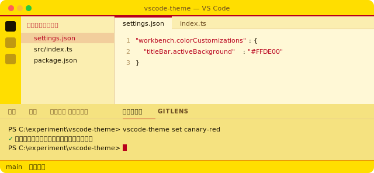
</div>

**テーマ名:** `canary-red`
**アクセント:** `#B8001C` &middot; **背景:** `#FFF8D6` &middot; **タイトルバー:** `#FFDE00`

---


### V &mdash; エンバーゴールド<!-- omit in toc -->


> 温かいチャコールに浮かぶアンティークゴールドと、アンバー色の残り火のハイライト。


<div align="center">
  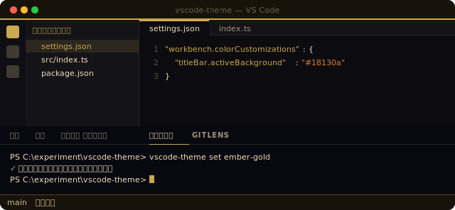
</div>

**テーマ名:** `ember-gold`
**アクセント:** `#C9A84E` &middot; **背景:** `#0c0c10` &middot; **タイトルバー:** `#18130a`

---


### W &mdash; アルパインサンセット<!-- omit in toc -->


> 山岳の夕暮れを思わせる紫のトワイライトに、サンセットレッドのアクセント。


<div align="center">
  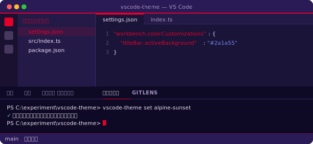
</div>

**テーマ名:** `alpine-sunset`
**アクセント:** `#E4002B` &middot; **背景:** `#1a1438` &middot; **タイトルバー:** `#2a1a55`

---


### X &mdash; セージペーパー<!-- omit in toc -->


> ペーパークリームの暖色背景にセージグリーンのアクセント。ブルーライトを抑えた目に優しい配色で、長時間の読書・コーディングセッション向け。


<div align="center">
  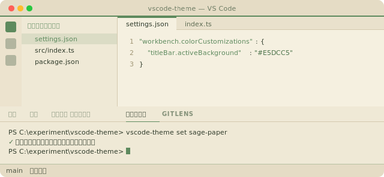
</div>

**テーマ名:** `sage-paper`  
**アクセント:** `#5E8A5E` &middot; **背景:** `#F5F0E0` &middot; **タイトルバー:** `#E5DCC5`

---


### Y &mdash; セージペーパー ダーク<!-- omit in toc -->


> 深い暖色オリーブ背景に、くすんだセージのアクセント。`sage-paper` のダーク版。暖色のアンダートーンがブルーライトを抑え、夜のコーディングに馴染む。


<div align="center">
  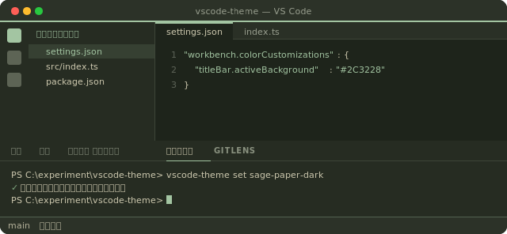
</div>

**テーマ名:** `sage-paper-dark`  
**アクセント:** `#A3C5A2` &middot; **背景:** `#1E241B` &middot; **タイトルバー:** `#2C3228`

---


### Z &mdash; プリズムスパーク<!-- omit in toc -->


> クールスレートの背景に、コーンフラワーブルー・コーラル・ミント・ゴールドの 4 色グラデーションパレットを UI 状態と ANSI パレットへ分配。4 点星プリズムからの着想。


<div align="center">
  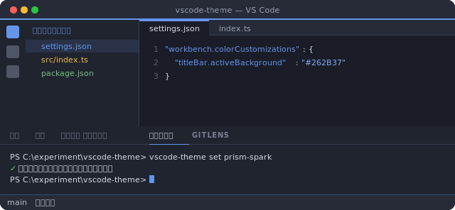
</div>

**テーマ名:** `prism-spark`  
**アクセント:** `#6495ED` &middot; **背景:** `#1A1D28` &middot; **タイトルバー:** `#262B37`

---


### AA &mdash; プリズムビビッド<!-- omit in toc -->


> `prism-spark` の彩度を上げた兄弟テーマ。コーラル・ブルー・ミント・ゴールド・マゼンタ・シアンの 6 色を UI の各サーフェスに割り振り、視線を動かすごとに違う色が現れる構成。


<div align="center">
  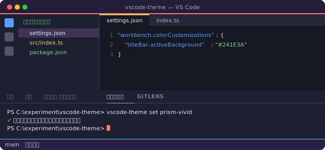
</div>

**テーマ名:** `prism-vivid`  
**アクセント:** `#5B9DFF`（プライマリ） &middot; **背景:** `#161923` &middot; **タイトルバー:** `#241E3A`

---


## インストール

テーマ JSON はすべてリポジトリ内の [.vscode-themes/](.vscode-themes/) に置かれています。スイッチャーは実行時に `~/.vscode-themes/` を参照するため、インストール手順は「これらの JSON を `~/.vscode-themes/` にコピーし、シェルプロファイルからスクリプトを source する」だけです。git 上のスクリプトには `__VERSION__` プレースホルダが入っており、以下の手順で [VERSION](VERSION) の現在値に置換されます（理由は [バージョン](#バージョン) を参照）。

**同じコマンドブロックをそのままアップデートにも使えます。** 手順はすべて冪等で、`cp` / `Copy-Item` は `~/.vscode-themes/` のテーマ JSON とバージョン入りスクリプトを上書きし、シェルプロファイルへの追記ステップは重複を防ぐガード付きなので再実行しても同じ `source` 行が二重に追加されません。新しいリポジトリを pull した後の更新（新テーマ・修正・[VERSION](VERSION) のバンプなど）は、このブロック全体を再実行するだけで済みます。別途のアップデート手順は不要です。

以下のコマンドは **リポジトリのルート** で実行してください。`VERSION`・`vscode-theme.sh` / `vscode-theme.ps1`・`.vscode-themes/` がすべてカレントディレクトリに揃っている必要があります。

### クイックインストール（推奨）

リポジトリには以下の手順をワンショットで実行できるインストーラが同梱されています。シェルに合わせて選び、いつでも再実行することでアップデートも兼ねられます。

```bash
# macOS / Linux（bash / zsh）
bash ./install.sh
```

```powershell
# Windows（PowerShell）
.\install.ps1
```

どちらのスクリプトも冪等です。`~/.vscode-themes/` 配下のインストール済みコピーを上書きし、リポジトリの作業ツリーはクリーンに保たれ（[vscode-theme.sh](vscode-theme.sh) / [vscode-theme.ps1](vscode-theme.ps1) の `__VERSION__` プレースホルダはバージョン焼き込み後に元に戻ります）、シェルプロファイルへの `source` / ドットソース行は既に存在しない場合のみ追加されます。

インストーラが実行している内容を確認したい場合は、以下に同等の手順を残してあります。

### macOS / Linux（bash / zsh）

```bash
# 1. テーマディレクトリを作成
mkdir -p ~/.vscode-themes

# 2. 同梱されているテーマ JSON をコピー
cp .vscode-themes/*.json ~/.vscode-themes/

# 3. 現在のバージョンを vscode-theme.sh に焼き込み、インストール先にコピー。
#    その後、リポジトリ側のコピーを __VERSION__ プレースホルダに戻して
#    作業ツリーをクリーンな状態に保つ。
VERSION=$(cat VERSION)
sed -i.bak "s/__VERSION__/${VERSION}/" vscode-theme.sh
cp vscode-theme.sh ~/.vscode-themes/vscode-theme.sh
mv vscode-theme.sh.bak vscode-theme.sh   # リポジトリ側のプレースホルダを復元

# 4. シェルプロファイル（~/.zshrc または ~/.bashrc）へ追記。
#    冪等：同じ行が既にある場合は追記しないので、アップデートでの再実行も安全。
LINE='source ~/.vscode-themes/vscode-theme.sh'
grep -qF "$LINE" ~/.zshrc 2>/dev/null || echo "$LINE" >> ~/.zshrc

# 5. シェルを再読み込み
source ~/.zshrc
```

### Windows（PowerShell）

```powershell
# 1. テーマディレクトリを作成
New-Item -ItemType Directory -Force "$HOME\.vscode-themes"

# 2. 同梱されているテーマ JSON をコピー
Copy-Item .vscode-themes\*.json "$HOME\.vscode-themes\"

# 3. 現在のバージョンを vscode-theme.ps1 に焼き込み、インストール先にコピー。
#    その後、リポジトリ側のコピーを __VERSION__ プレースホルダに戻して
#    作業ツリーをクリーンな状態に保つ。
$version  = (Get-Content VERSION -Raw).Trim()
$original = Get-Content vscode-theme.ps1 -Raw
($original -replace '__VERSION__', $version) | Set-Content vscode-theme.ps1 -NoNewline
Copy-Item vscode-theme.ps1 "$HOME\.vscode-themes\vscode-theme.ps1"
Set-Content vscode-theme.ps1 -Value $original -NoNewline   # プレースホルダを復元

# 4. インストール先のスクリプトの実行ブロックを解除（インターネット経由で取得した場合に必要）
Unblock-File "$HOME\.vscode-themes\vscode-theme.ps1"

# 5. PowerShell プロファイルへ追記。
#    冪等：同じ行が既にある場合は追記しないので、アップデートでの再実行も安全。
#    注意：プロファイルファイルの存在確認に -Force を付けてはいけない。
#    -Force は既存ファイルを上書きしてしまい、ユーザーの既存プロファイル
#    内容が消えてしまう。
$line = ". `"$HOME\.vscode-themes\vscode-theme.ps1`""
New-Item -ItemType Directory -Force (Split-Path $PROFILE) | Out-Null
if (-not (Test-Path -LiteralPath $PROFILE)) {
    New-Item -ItemType File -Path $PROFILE | Out-Null
}
if (-not ((Get-Content $PROFILE -ErrorAction SilentlyContinue) -contains $line)) {
    Add-Content $PROFILE $line
}

# 6. プロファイルを再読み込み
. $PROFILE
```

---

## 使い方

サブコマンドは bash / PowerShell どちらでも同じです。グローバルスコープを指定するフラグの書式だけシェルごとのパラメータ慣習に合わせて異なります。

| 操作                                            | bash / zsh                                                                          | PowerShell                                                                          |
| ----------------------------------------------- | ----------------------------------------------------------------------------------- | ----------------------------------------------------------------------------------- |
| 利用可能なテーマを一覧表示                      | `vscode-theme list`                                                                 | `vscode-theme list`                                                                 |
| 現在の状態を表示（グローバル + ワークスペース） | `vscode-theme status`                                                               | `vscode-theme status`                                                               |
| 対話的にテーマを選択（ワークスペース）          | `vscode-theme set`                                                                  | `vscode-theme set`                                                                  |
| 対話的にテーマを選択（グローバル）              | `vscode-theme set --global`<br>`vscode-theme set -g`                                | `vscode-theme set -Global`<br>`vscode-theme set -g`                                 |
| 現在のワークスペースにテーマを適用              | `vscode-theme set navy-orange`                                                      | `vscode-theme set navy-orange`                                                      |
| テーマをグローバルに適用                        | `vscode-theme set navy-orange --global`<br>`vscode-theme set navy-orange -g`        | `vscode-theme set navy-orange -Global`<br>`vscode-theme set navy-orange -g`         |
| ワークスペースのテーマをリセット                | `vscode-theme reset`                                                                | `vscode-theme reset`                                                                |
| グローバルのテーマをリセット                    | `vscode-theme reset --global`<br>`vscode-theme reset -g`                            | `vscode-theme reset -Global`<br>`vscode-theme reset -g`                             |
| バージョンを表示                                | `vscode-theme version`<br>`vscode-theme --version`<br>`vscode-theme -v`             | `vscode-theme version`<br>`vscode-theme --version`<br>`vscode-theme -v`             |
| ヘルプを表示                                    | `vscode-theme help`<br>`vscode-theme --help`<br>`vscode-theme -h`<br>`vscode-theme` | `vscode-theme help`<br>`vscode-theme --help`<br>`vscode-theme -h`<br>`vscode-theme` |

**対話型ピッカー。** テーマ名を付けずに `vscode-theme set` を実行すると、ターミナル内でピッカーが開きます。カーソルを移動するたびに VSCode 側へそのテーマがリアルタイムで適用されるので、見た目を確認しながら選べます。

| キー                      | 動作                                                                  |
| ------------------------- | --------------------------------------------------------------------- |
| `↑` / `↓`（または `k` / `j`） | ハイライトを移動（選択中のテーマが即座に適用される）                  |
| `Enter`                   | ハイライト中のテーマで確定                                            |
| `Esc` または `q`          | キャンセルし、`settings.json` をピッカー起動前の状態へ戻す            |
| `Ctrl+C`                  | キャンセルと同じ扱い                                                  |

キャンセル時はファイルをバイト単位で元に戻します。もともと `settings.json` が無かった場合は削除し、存在していた場合は `__vscode_theme_backup` などを含むすべての中身をそのまま復元します。

**グローバルフラグについての注意。** PowerShell ではスイッチにシングルダッシュ＋キャメルケース（`-Global`）を使うのがネイティブの慣習で、`--global` は PowerShell の文法としては有効ではありません。bash スクリプトは `-g` と `--global` を、PowerShell スクリプトは `-g` と `-Global`（大文字小文字を区別しないので `-global` でも可）を受け付けます。短縮形 `-g` は両シェルで共通です。

テーマを適用したら、VSCode のウィンドウを再読み込みしてください：  
`Ctrl+Shift+P`（Windows / Linux）または `Cmd+Shift+P`（macOS）→ **Reload Window**

---

## 仕組み

`vscode-theme set <name>` を実行すると、ツールは以下を行います：

1. `~/.vscode-themes/<name>.json` からテーマ JSON を読み込む
2. 対象の `settings.json` を開く（なければ作成する）
3. `workbench.colorCustomizations` が既に存在し、かつ **このツール由来ではない** 場合、同じファイル内の `__vscode_theme_backup` として退避する
4. 新しい色を書き込み、`__vscode_theme_managed` にテーマ名を刻印する

`vscode-theme reset` を実行すると：

1. `__vscode_theme_backup` があれば → `workbench.colorCustomizations` に書き戻す
2. バックアップが無ければ → `workbench.colorCustomizations` ごと削除する
3. 削除した結果ワークスペースの `settings.json` が空になったら、ファイル自体も削除する
4. この間、`settings.json` 内の他の設定には一切手を加えない

```
settings.json（テーマ適用中）
├── workbench.colorCustomizations   ← テーマの色
├── __vscode_theme_managed          ← "navy-orange"
├── __vscode_theme_backup           ← 元々の色（既存のものがあった場合）
└── ... その他の設定 ...            ← 一切変更しない
```

bash 版は JSON のマージに Python（`python3` または `python`）を使うので、どちらかが `PATH` に通っている必要があります。PowerShell 版は組み込みの `ConvertFrom-Json` / `ConvertTo-Json` を使うため、追加の依存はありません。

---

## ファイル構成

| ファイル                                                                   | 説明                                                            |
| -------------------------------------------------------------------------- | --------------------------------------------------------------- |
| [VERSION](VERSION)                                                         | ツールのバージョンの唯一の情報源                                |
| [vscode-theme.sh](vscode-theme.sh)                                         | macOS / Linux（bash / zsh）用のシェル関数。`__VERSION__` を保持 |
| [vscode-theme.ps1](vscode-theme.ps1)                                       | Windows 用の PowerShell 関数。`__VERSION__` を保持              |
| [.vscode-themes/navy-orange.json](.vscode-themes/navy-orange.json)         | テーマ A — Navy + orange                                        |
| [.vscode-themes/squidink-yellow.json](.vscode-themes/squidink-yellow.json) | テーマ B — Squid ink + yellow                                   |
| [.vscode-themes/bedrock-teal.json](.vscode-themes/bedrock-teal.json)       | テーマ C — Bedrock teal                                         |
| [.vscode-themes/dark-ember.json](.vscode-themes/dark-ember.json)           | テーマ D — Dark + ember red                                     |
| [.vscode-themes/forest-green.json](.vscode-themes/forest-green.json)       | テーマ E — Forest green                                         |
| [.vscode-themes/royal-purple.json](.vscode-themes/royal-purple.json)       | テーマ F — Royal purple                                         |
| [.vscode-themes/ocean-blue.json](.vscode-themes/ocean-blue.json)           | テーマ G — Ocean blue                                           |
| [.vscode-themes/rose-magenta.json](.vscode-themes/rose-magenta.json)       | テーマ H — Rose magenta                                         |
| [.vscode-themes/paper-light.json](.vscode-themes/paper-light.json)         | テーマ I — Paper light                                          |
| [.vscode-themes/arctic-light.json](.vscode-themes/arctic-light.json)       | テーマ J — Arctic light                                         |
| [.vscode-themes/frappe-teal.json](.vscode-themes/frappe-teal.json)         | テーマ K — Frappé teal（Catppuccin インスパイアのダーク）       |
| [.vscode-themes/dawn-teal.json](.vscode-themes/dawn-teal.json)             | テーマ L — Dawn teal（Rosé Pine Dawn インスパイアのライト）     |
| [.vscode-themes/leather-orange.json](.vscode-themes/leather-orange.json)   | テーマ M — レザーオレンジ                                       |
| [.vscode-themes/cocoa-gold.json](.vscode-themes/cocoa-gold.json)           | テーマ N — ココアゴールド                                       |
| [.vscode-themes/espresso-green.json](.vscode-themes/espresso-green.json)   | テーマ O — エスプレッソグリーン（ライト）                       |
| [.vscode-themes/mountain-sunset.json](.vscode-themes/mountain-sunset.json) | テーマ P — マウンテンサンセット                                 |
| [.vscode-themes/leather-orange-light.json](.vscode-themes/leather-orange-light.json) | テーマ Q — レザーオレンジ（ライト）                     |
| [.vscode-themes/cocoa-gold-light.json](.vscode-themes/cocoa-gold-light.json) | テーマ R — ココアゴールド（ライト）                             |
| [.vscode-themes/espresso-green-dark.json](.vscode-themes/espresso-green-dark.json) | テーマ S — エスプレッソグリーン（ダーク）                 |
| [.vscode-themes/cobalt-crimson.json](.vscode-themes/cobalt-crimson.json) | テーマ T — コバルト + クリムゾン                                |
| [.vscode-themes/canary-red.json](.vscode-themes/canary-red.json)         | テーマ U — カナリー + レッド（ライト）                          |
| [.vscode-themes/ember-gold.json](.vscode-themes/ember-gold.json)         | テーマ V — エンバーゴールド                                     |
| [.vscode-themes/alpine-sunset.json](.vscode-themes/alpine-sunset.json)   | テーマ W — アルパインサンセット                                 |
| [.vscode-themes/sage-paper.json](.vscode-themes/sage-paper.json)         | テーマ X — セージペーパー（ライト、目に優しい）                 |
| [.vscode-themes/sage-paper-dark.json](.vscode-themes/sage-paper-dark.json) | テーマ Y — セージペーパー ダーク（ダーク、目に優しい）         |
| [.vscode-themes/prism-spark.json](.vscode-themes/prism-spark.json)       | テーマ Z — プリズムスパーク（4 色グラデーション、ダーク）        |
| [.vscode-themes/prism-vivid.json](.vscode-themes/prism-vivid.json)       | テーマ AA — プリズムビビッド（6 色を UI 全面分配、ダーク）       |

---

## バージョン

このツールのバージョンは、リポジトリのルートにある単一のファイル [VERSION](VERSION) に記載されています。バージョン番号が書かれる場所は **このファイルだけ** です。

### バージョンの伝わり方

git 上の両方のシェルスクリプトは、ハードコードされた文字列ではなく `__VERSION__` というリテラルのプレースホルダを持っています：

```sh
# vscode-theme.sh
VSCODE_THEME_VERSION="__VERSION__"
```

```powershell
# vscode-theme.ps1
$script:VT_VERSION = '__VERSION__'
```

[インストール](#インストール) の手順は、`VERSION` を読み取り、リポジトリ側のスクリプトでプレースホルダを置換し、バージョン入りのスクリプトを `~/.vscode-themes/` にコピーしたあと、リポジトリ側のコピーを `__VERSION__` に **戻します**。結果として：

- インストール先のコピー（`~/.vscode-themes/vscode-theme.{sh,ps1}`）には実際のバージョンが焼き込まれているので、エンドユーザーが `vscode-theme version` を実行するとバージョンが表示されます。
- リポジトリの作業ツリーはクリーンなまま。インストール後の `git status` には差分が出ません。
- バージョンを上げたいときに編集する場所は [VERSION](VERSION) の一箇所だけ。あとはインストール手順を再実行すれば自動で反映されます。コードの書き換えは不要で、スクリプトと README の値がずれることもありません。
