# vscode-theme<!-- omit in toc -->
A tiny command-line switcher that applies VSCode UI color themes to either your workspace (`.vscode/settings.json`) or your global VSCode settings — with automatic backup of any existing `workbench.colorCustomizations` and a clean reset.

Ships with a set of dark and light themes out of the box ([.vscode-themes/](.vscode-themes/)), including a Catppuccin-inspired dark/light pair (`frappe-teal` / `dawn-teal`) sharing a teal accent. Drop any other `<name>.json` file into your theme directory to add more.

> 日本語版: [README.ja.md](README.ja.md)

---

- [Theme previews](#theme-previews)
- [Using themes as workspace identity markers](#using-themes-as-workspace-identity-markers)
- [Installation](#installation)
  - [macOS / Linux (bash / zsh)](#macos--linux-bash--zsh)
  - [Windows (PowerShell)](#windows-powershell)
- [Usage](#usage)
- [How it works](#how-it-works)
- [Files](#files)
- [Version](#version)
  - [How the version flows](#how-the-version-flows)

## Theme previews

<style>
.vsc-card .sb-item { cursor: pointer; transition: background .08s ease, color .08s ease; }
.vsc-card .sb-item:not(.sb-active):hover { background: var(--hvr-bg); color: var(--hvr-fg); }
.vsc-card .tab-inactive { cursor: pointer; transition: background .08s ease, color .08s ease; }
.vsc-card .tab-inactive:hover { background: var(--hvr-bg); color: var(--hvr-fg); }
</style>

### A &mdash; Navy + orange<!-- omit in toc -->


> Dark navy background with orange accents.


<div align="center">
  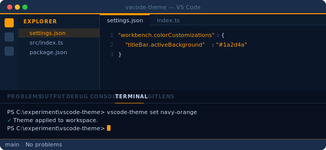
</div>

**Theme name:** `navy-orange`  
**Accent:** `#FF9900` &middot; **Background:** `#0a1628` &middot; **Title bar:** `#1a2d4a`

---

### B &mdash; Squid ink + yellow<!-- omit in toc -->


> Deep squid-ink background with gold yellow accents.


<div align="center">
  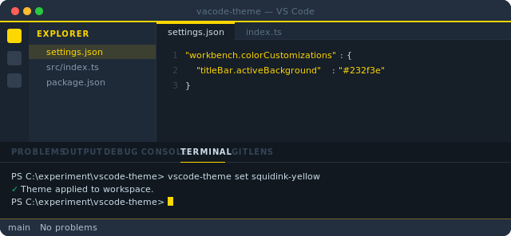
</div>

**Theme name:** `squidink-yellow`  
**Accent:** `#FFD700` &middot; **Background:** `#161e28` &middot; **Title bar:** `#232f3e`

---

### C &mdash; Bedrock teal<!-- omit in toc -->


> Dark teal with cyan-green accents.


<div align="center">
  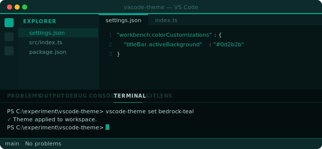
</div>

**Theme name:** `bedrock-teal`  
**Accent:** `#01A88D` &middot; **Background:** `#061616` &middot; **Title bar:** `#0d2b2b`

---

### D &mdash; Dark + ember red<!-- omit in toc -->


> Very dark background with ember red accents — hard to mistake for any other window.


<div align="center">
  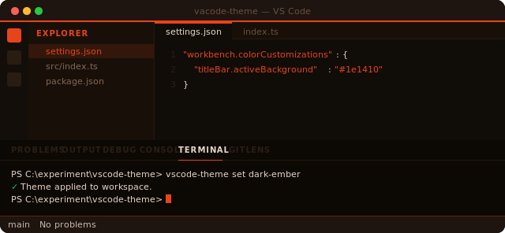
</div>

**Theme name:** `dark-ember`  
**Accent:** `#E8441A` &middot; **Background:** `#100c08` &middot; **Title bar:** `#1e1410`

---

### E &mdash; Forest green<!-- omit in toc -->


> Deep woodland background with a vivid spring-green accent.


<div align="center">
  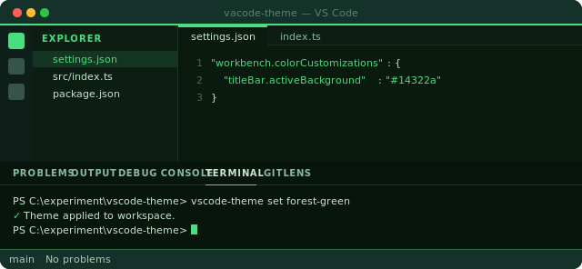
</div>

**Theme name:** `forest-green`  
**Accent:** `#4ADE80` &middot; **Background:** `#0a1a0f` &middot; **Title bar:** `#14322a`

---

### F &mdash; Royal purple<!-- omit in toc -->


> Dark plum background with a rich violet accent.


<div align="center">
  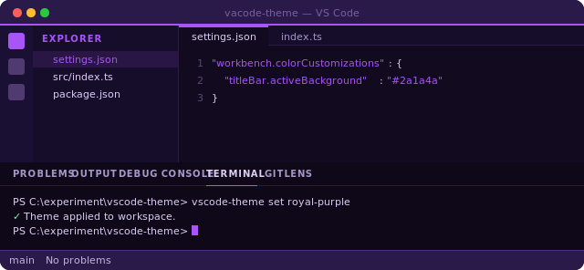
</div>

**Theme name:** `royal-purple`  
**Accent:** `#A855F7` &middot; **Background:** `#120a1f` &middot; **Title bar:** `#2a1a4a`

---

### G &mdash; Ocean blue<!-- omit in toc -->


> Deep ocean background with a bright sky-cyan accent.


<div align="center">
  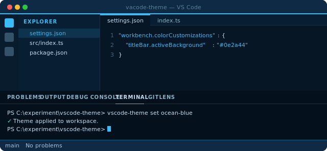
</div>

**Theme name:** `ocean-blue`  
**Accent:** `#38BDF8` &middot; **Background:** `#061624` &middot; **Title bar:** `#0e2a44`

---

### H &mdash; Rose magenta<!-- omit in toc -->


> Dark wine background with a hot-pink magenta accent.


<div align="center">
  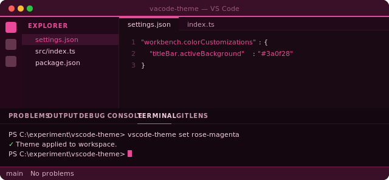
</div>

**Theme name:** `rose-magenta`  
**Accent:** `#EC4899` &middot; **Background:** `#1a0a14` &middot; **Title bar:** `#3a0f28`

---

### I &mdash; Paper light<!-- omit in toc -->


> Warm cream paper background with a sepia-brown accent. A light theme for daylight coding.


<div align="center">
  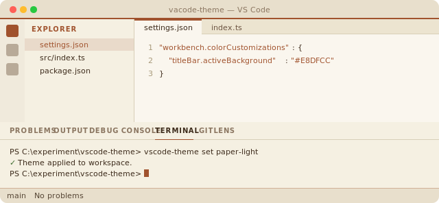
</div>

**Theme name:** `paper-light`  
**Accent:** `#A0522D` &middot; **Background:** `#FAF6EE` &middot; **Title bar:** `#E8DFCC`

---

### J &mdash; Arctic light<!-- omit in toc -->


> Cool frost-white background with a crisp steel-blue accent. A light theme with quiet contrast.


<div align="center">
  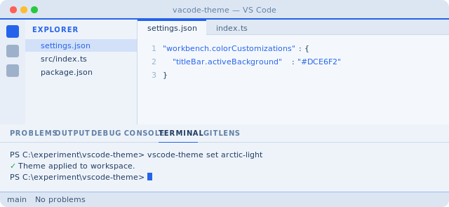
</div>

**Theme name:** `arctic-light`  
**Accent:** `#2563EB` &middot; **Background:** `#F4F8FC` &middot; **Title bar:** `#DCE6F2`

---

### K &mdash; Frappé teal<!-- omit in toc -->


> Catppuccin Frappé-inspired dark with a vivid teal accent. Designed to pair visually with `dawn-teal` for a matched dark/light set.


<div align="center">
  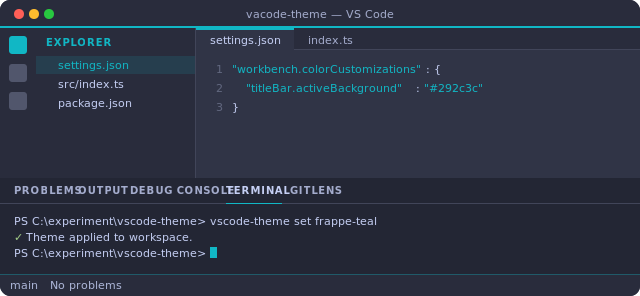
</div>

**Theme name:** `frappe-teal`  
**Accent:** `#11B7C5` &middot; **Background:** `#303446` &middot; **Title bar:** `#292c3c`

---

### L &mdash; Dawn teal<!-- omit in toc -->


> Rosé Pine Dawn-inspired light cream background with a deep teal accent. The light counterpart to `frappe-teal`.


<div align="center">
  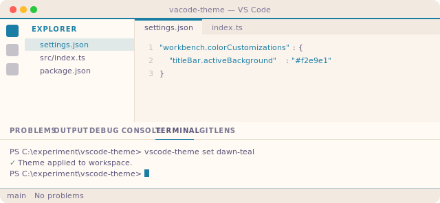
</div>

**Theme name:** `dawn-teal`  
**Accent:** `#1A7DA4` &middot; **Background:** `#faf4ed` &middot; **Title bar:** `#f2e9e1`

---

### M &mdash; Leather orange<!-- omit in toc -->


> Rich burnt orange on saddle-leather brown.


<div align="center">
  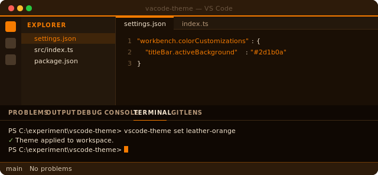
</div>

**Theme name:** `leather-orange`
**Accent:** `#F67B00` &middot; **Background:** `#1a0f05` &middot; **Title bar:** `#2d1b0a`

---

### N &mdash; Cocoa gold<!-- omit in toc -->


> Warm cocoa brown with antique gold accents.


<div align="center">
  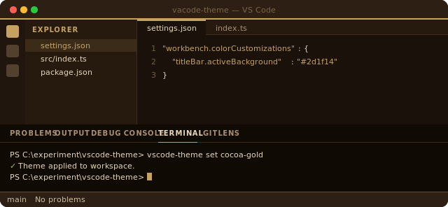
</div>

**Theme name:** `cocoa-gold`
**Accent:** `#C5A260` &middot; **Background:** `#1a120a` &middot; **Title bar:** `#2d1f14`

---

### O &mdash; Espresso green<!-- omit in toc -->


> Deep espresso green accent on warm cream.


<div align="center">
  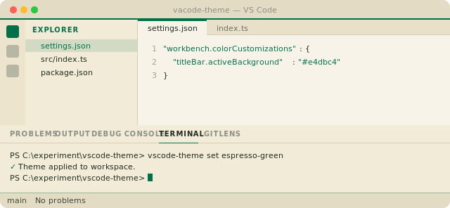
</div>

**Theme name:** `espresso-green`
**Accent:** `#00704A` &middot; **Background:** `#f8f3e8` &middot; **Title bar:** `#e4dbc4`

---

### P &mdash; Mountain sunset<!-- omit in toc -->


> Sunset peach over twilight peaks and cerulean sky.


<div align="center">
  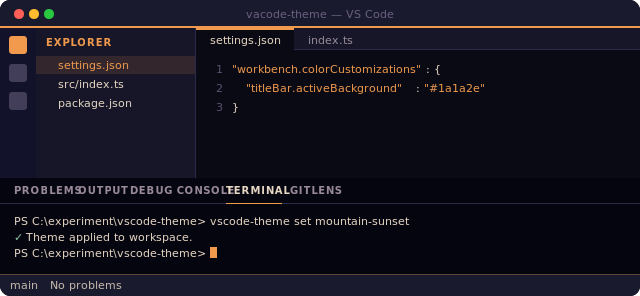
</div>

**Theme name:** `mountain-sunset`
**Accent:** `#F19A4D` &middot; **Background:** `#0a0a14` &middot; **Title bar:** `#1a1a2e`

---


### T &mdash; Cobalt + crimson<!-- omit in toc -->


> Deep cobalt blue with bright crimson accents &mdash; primary-color, high-contrast identity.


<div align="center">
  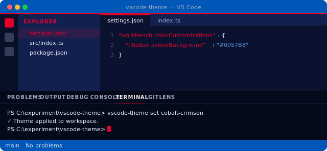
</div>

**Theme name:** `cobalt-crimson`
**Accent:** `#E4002B` &middot; **Background:** `#0a1230` &middot; **Title bar:** `#0057B8`

---


### U &mdash; Canary + red (light)<!-- omit in toc -->


> Canary-yellow light base with racing-red accents and a touch of Italian green.


<div align="center">
  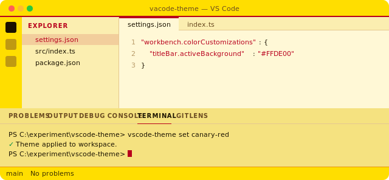
</div>

**Theme name:** `canary-red`
**Accent:** `#B8001C` &middot; **Background:** `#FFF8D6` &middot; **Title bar:** `#FFDE00`

---


### V &mdash; Ember gold<!-- omit in toc -->


> Antique gold over warm charcoal with amber-ember highlights &mdash; muted and glowing.


<div align="center">
  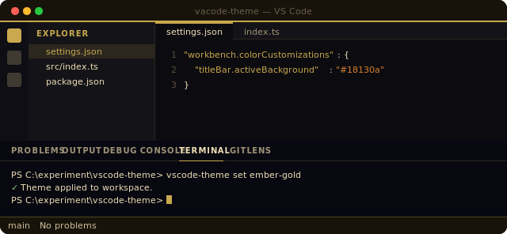
</div>

**Theme name:** `ember-gold`
**Accent:** `#C9A84E` &middot; **Background:** `#0c0c10` &middot; **Title bar:** `#18130a`

---


### W &mdash; Alpine sunset<!-- omit in toc -->


> Alpine twilight purple with sunset-red accents over mountain indigo.


<div align="center">
  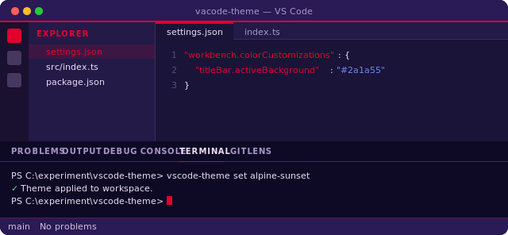
</div>

**Theme name:** `alpine-sunset`
**Accent:** `#E4002B` &middot; **Background:** `#1a1438` &middot; **Title bar:** `#2a1a55`

---


### X &mdash; Sage paper<!-- omit in toc -->


> Sage green on warm paper cream. Eye-friendly low-blue-light palette for long reading sessions.


<div align="center">
  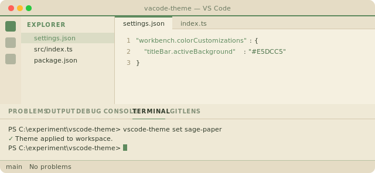
</div>

**Theme name:** `sage-paper`  
**Accent:** `#5E8A5E` &middot; **Background:** `#F5F0E0` &middot; **Title bar:** `#E5DCC5`

---


### Y &mdash; Sage paper dark<!-- omit in toc -->


> Deep warm olive with muted sage accents. Dark counterpart to `sage-paper` — warm undertones reduce blue light for night coding.


<div align="center">
  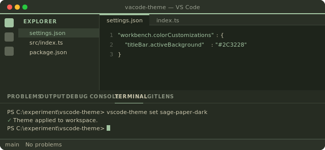
</div>

**Theme name:** `sage-paper-dark`  
**Accent:** `#A3C5A2` &middot; **Background:** `#1E241B` &middot; **Title bar:** `#2C3228`

---


### Z &mdash; Prism spark<!-- omit in toc -->


> Cool slate base with a four-color gradient palette — cornflower blue, coral, mint, and gold — distributed across UI states and terminal ANSI. Inspired by a 4-pointed prism star.


<div align="center">
  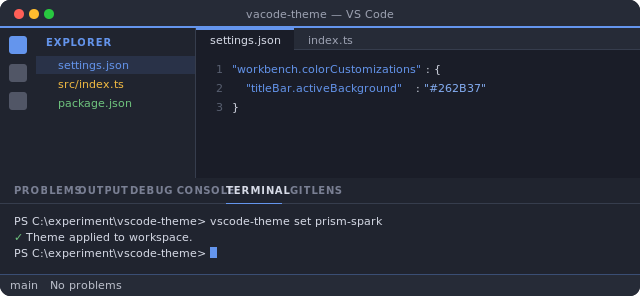
</div>

**Theme name:** `prism-spark`  
**Accent:** `#6495ED` &middot; **Background:** `#1A1D28` &middot; **Title bar:** `#262B37`

---


### AA &mdash; Prism vivid<!-- omit in toc -->


> Saturated sibling of `prism-spark`. All six palette colors — coral, blue, mint, gold, magenta, cyan — distributed across distinct UI surfaces so every region carries its own identity color.


<div align="center">
  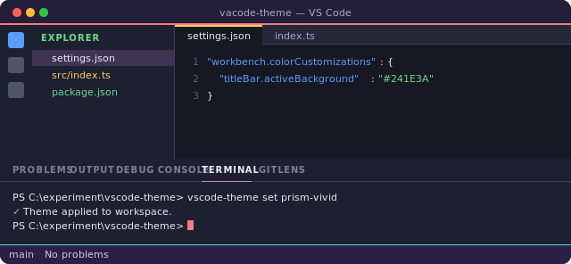
</div>

**Theme name:** `prism-vivid`  
**Accent:** `#5B9DFF` (primary) &middot; **Background:** `#161923` &middot; **Title bar:** `#241E3A`

---


## Using themes as workspace identity markers

Because each theme paints the title bar, activity bar, and status bar with a strong accent, you can use them as *visual environment tags* across VSCode windows — at a glance you always know whether you're looking at prod, staging, or your scratchpad. Apply a theme globally for your default, and override per-workspace with `vscode-theme set <name>` inside any project folder.

One suggested mapping:

| Role                            | Theme                            | Why                                                                            |
| ------------------------------- | -------------------------------- | ------------------------------------------------------------------------------ |
| **Production / danger zone**    | `dark-ember`                     | Ember red reads as "be careful here".                                          |
| **Staging / pre-prod**          | `squidink-yellow`                | Gold = caution but not stop.                                                   |
| **Development**                 | `forest-green` or `bedrock-teal` | Green = safe, go.                                                              |
| **Personal / side projects**    | `royal-purple` or `rose-magenta` | Clearly distinct from any work window.                                         |
| **Cloud / infra work**          | `navy-orange` or `ocean-blue`    | Cool tones for long-running infra sessions.                                    |
| **Docs / writing / daylight**   | `paper-light` or `arctic-light`  | Light themes for reading-heavy or bright-room work.                            |
| **Coordinated dark/light pair** | `frappe-teal` + `dawn-teal`      | Shared teal accent — switch by ambient light without changing visual identity. |
| **Long sessions / eye comfort** | `sage-paper` + `sage-paper-dark` | Low-blue-light warm palette for extended work — switch by time of day.         |

This is just a convention — pick whatever color-to-meaning mapping feels right to you. The tool doesn't enforce any of it.

---

## Installation

All theme JSONs live in [.vscode-themes/](.vscode-themes/) in this repo. The switcher looks them up from `~/.vscode-themes/` at runtime, so installation is: copy those JSONs into `~/.vscode-themes/`, then source the script from your shell profile. The scripts in git carry a `__VERSION__` placeholder that the install steps below replace with the current value from [VERSION](VERSION) — see [Version](#version) for why.

**The same block also serves as an update.** The steps are idempotent: `cp` / `Copy-Item` overwrite the theme JSONs and the versioned script in `~/.vscode-themes/`, and the shell-profile-append step is guarded so rerunning never adds a duplicate `source` line. To update after pulling a newer repo (new themes, fixes, or a bumped [VERSION](VERSION)), rerun the whole block — no separate update procedure needed.

Run the commands below from the **repo root**, so `VERSION`, `vscode-theme.sh` / `vscode-theme.ps1`, and `.vscode-themes/` are all in the current directory.

### Quick install (recommended)

The repo ships a one-shot installer that wraps every step below — pick the one that matches your shell and rerun any time to update.

```bash
# macOS / Linux (bash / zsh)
bash ./install.sh
```

```powershell
# Windows (PowerShell)
.\install.ps1
```

Both scripts are idempotent: they overwrite the installed copies under `~/.vscode-themes/`, leave the repo working tree clean (the `__VERSION__` placeholder in [vscode-theme.sh](vscode-theme.sh) / [vscode-theme.ps1](vscode-theme.ps1) is restored after baking), and only append the `source` / dot-source line to your shell profile if it isn't already there.

If you'd rather see what the installer does, the equivalent step-by-step commands are below.

### macOS / Linux (bash / zsh)

```bash
# 1. Create the theme directory
mkdir -p ~/.vscode-themes

# 2. Copy the bundled theme JSONs
cp .vscode-themes/*.json ~/.vscode-themes/

# 3. Bake the current version into vscode-theme.sh, copy it to the install
#    location, then revert the repo copy back to its __VERSION__ placeholder
#    so the working tree stays clean.
VERSION=$(cat VERSION)
sed -i.bak "s/__VERSION__/${VERSION}/" vscode-theme.sh
cp vscode-theme.sh ~/.vscode-themes/vscode-theme.sh
mv vscode-theme.sh.bak vscode-theme.sh   # restore the placeholder in the repo

# 4. Add to shell profile (~/.zshrc or ~/.bashrc) — idempotent: only append
#    if the line isn't already there, so rerunning as an update is safe.
LINE='source ~/.vscode-themes/vscode-theme.sh'
grep -qF "$LINE" ~/.zshrc 2>/dev/null || echo "$LINE" >> ~/.zshrc

# 5. Reload shell
source ~/.zshrc
```

### Windows (PowerShell)

```powershell
# 1. Create the theme directory
New-Item -ItemType Directory -Force "$HOME\.vscode-themes"

# 2. Copy the bundled theme JSONs
Copy-Item .vscode-themes\*.json "$HOME\.vscode-themes\"

# 3. Bake the current version into vscode-theme.ps1, copy it to the install
#    location, then revert the repo copy back to its __VERSION__ placeholder
#    so the working tree stays clean.
$version  = (Get-Content VERSION -Raw).Trim()
$original = Get-Content vscode-theme.ps1 -Raw
($original -replace '__VERSION__', $version) | Set-Content vscode-theme.ps1 -NoNewline
Copy-Item vscode-theme.ps1 "$HOME\.vscode-themes\vscode-theme.ps1"
Set-Content vscode-theme.ps1 -Value $original -NoNewline   # restore placeholder

# 4. Unblock the installed script (required if downloaded from the internet)
Unblock-File "$HOME\.vscode-themes\vscode-theme.ps1"

# 5. Add to PowerShell profile — idempotent: only append if the line isn't
#    already there, so rerunning as an update is safe. Note: do NOT pass
#    -Force when ensuring the profile file exists — -Force overwrites
#    existing files and would wipe any custom profile content.
$line = ". `"$HOME\.vscode-themes\vscode-theme.ps1`""
New-Item -ItemType Directory -Force (Split-Path $PROFILE) | Out-Null
if (-not (Test-Path -LiteralPath $PROFILE)) {
    New-Item -ItemType File -Path $PROFILE | Out-Null
}
if (-not ((Get-Content $PROFILE -ErrorAction SilentlyContinue) -contains $line)) {
    Add-Content $PROFILE $line
}

# 6. Reload profile
. $PROFILE
```

---

## Usage

The same subcommands work in both shells. Only the global-scope flag differs in syntax, because each shell has its own parameter convention.

| Action                                   | bash / zsh                                                                          | PowerShell                                                                          |
| ---------------------------------------- | ----------------------------------------------------------------------------------- | ----------------------------------------------------------------------------------- |
| List available themes                    | `vscode-theme list`                                                                 | `vscode-theme list`                                                                 |
| Show current status (global + workspace) | `vscode-theme status`                                                               | `vscode-theme status`                                                               |
| Pick a theme interactively (workspace)   | `vscode-theme set`                                                                  | `vscode-theme set`                                                                  |
| Pick a theme interactively (global)      | `vscode-theme set --global`<br>`vscode-theme set -g`                                | `vscode-theme set -Global`<br>`vscode-theme set -g`                                 |
| Apply a theme to the current workspace   | `vscode-theme set navy-orange`                                                      | `vscode-theme set navy-orange`                                                      |
| Apply a theme globally                   | `vscode-theme set navy-orange --global`<br>`vscode-theme set navy-orange -g`        | `vscode-theme set navy-orange -Global`<br>`vscode-theme set navy-orange -g`         |
| Reset workspace theme                    | `vscode-theme reset`                                                                | `vscode-theme reset`                                                                |
| Reset global theme                       | `vscode-theme reset --global`<br>`vscode-theme reset -g`                            | `vscode-theme reset -Global`<br>`vscode-theme reset -g`                             |
| Show version                             | `vscode-theme version`<br>`vscode-theme --version`<br>`vscode-theme -v`             | `vscode-theme version`<br>`vscode-theme --version`<br>`vscode-theme -v`             |
| Show help                                | `vscode-theme help`<br>`vscode-theme --help`<br>`vscode-theme -h`<br>`vscode-theme` | `vscode-theme help`<br>`vscode-theme --help`<br>`vscode-theme -h`<br>`vscode-theme` |

**Interactive picker.** `vscode-theme set` with no theme name opens an in-terminal picker that previews each theme live in VSCode as you move through the list.

| Key                      | Action                                                         |
| ------------------------ | -------------------------------------------------------------- |
| `↑` / `↓` (or `k` / `j`) | Move the highlight (the selected theme is applied immediately) |
| `Enter`                  | Keep the currently-highlighted theme                           |
| `Esc` or `q`             | Cancel and revert `settings.json` to its pre-picker state      |
| `Ctrl+C`                 | Same as cancel                                                 |

Cancelling restores the file byte-for-byte: if no `settings.json` existed before, it is removed again; if one existed, its previous contents (including any `__vscode_theme_backup`) are restored untouched.

**Note on the global flag.** PowerShell uses single-dash CamelCase for switches (`-Global`), which is its native convention — `--global` is not valid PowerShell syntax. The bash script accepts `-g` or `--global`; the PowerShell script accepts `-g` or `-Global` (case-insensitive, so `-global` works too). The short form `-g` is identical in both shells.

After applying a theme, reload the VSCode window:  
`Ctrl+Shift+P` (Windows / Linux) or `Cmd+Shift+P` (macOS) → **Reload Window**

---

## How it works

When you run `vscode-theme set <name>`, the tool:

1. Reads the theme JSON from `~/.vscode-themes/<name>.json`
2. Opens (or creates) the target `settings.json`
3. If `workbench.colorCustomizations` already exists and was **not** set by this tool, saves it as `__vscode_theme_backup` inside the same file
4. Writes the new colors and stamps `__vscode_theme_managed` with the theme name

When you run `vscode-theme reset`:

1. If `__vscode_theme_backup` exists → restores it back to `workbench.colorCustomizations`
2. If no backup → removes `workbench.colorCustomizations` entirely
3. If removing leaves the workspace `settings.json` empty, the file itself is deleted
4. All other settings in `settings.json` are untouched throughout

```
settings.json (while theme is active)
├── workbench.colorCustomizations   ← theme colors
├── __vscode_theme_managed          ← "navy-orange"
├── __vscode_theme_backup           ← original colors (if any existed before)
└── ... your other settings ...     ← never touched
```

The bash version uses Python (`python3` or `python`) for JSON merging; make sure one is on your `PATH`. The PowerShell version uses built-in `ConvertFrom-Json` / `ConvertTo-Json` and has no extra dependencies.

---

## Files

| File                                                                                 | Description                                                           |
| ------------------------------------------------------------------------------------ | --------------------------------------------------------------------- |
| [VERSION](VERSION)                                                                   | Single source of truth for the tool's version                         |
| [vscode-theme.sh](vscode-theme.sh)                                                   | Shell function for macOS / Linux (bash / zsh) — carries `__VERSION__` |
| [vscode-theme.ps1](vscode-theme.ps1)                                                 | PowerShell function for Windows — carries `__VERSION__`               |
| [.vscode-themes/navy-orange.json](.vscode-themes/navy-orange.json)                   | Theme A — Navy + orange                                               |
| [.vscode-themes/squidink-yellow.json](.vscode-themes/squidink-yellow.json)           | Theme B — Squid ink + yellow                                          |
| [.vscode-themes/bedrock-teal.json](.vscode-themes/bedrock-teal.json)                 | Theme C — Bedrock teal                                                |
| [.vscode-themes/dark-ember.json](.vscode-themes/dark-ember.json)                     | Theme D — Dark + ember red                                            |
| [.vscode-themes/forest-green.json](.vscode-themes/forest-green.json)                 | Theme E — Forest green                                                |
| [.vscode-themes/royal-purple.json](.vscode-themes/royal-purple.json)                 | Theme F — Royal purple                                                |
| [.vscode-themes/ocean-blue.json](.vscode-themes/ocean-blue.json)                     | Theme G — Ocean blue                                                  |
| [.vscode-themes/rose-magenta.json](.vscode-themes/rose-magenta.json)                 | Theme H — Rose magenta                                                |
| [.vscode-themes/paper-light.json](.vscode-themes/paper-light.json)                   | Theme I — Paper light                                                 |
| [.vscode-themes/arctic-light.json](.vscode-themes/arctic-light.json)                 | Theme J — Arctic light                                                |
| [.vscode-themes/frappe-teal.json](.vscode-themes/frappe-teal.json)                   | Theme K — Frappé teal (Catppuccin-inspired dark)                      |
| [.vscode-themes/dawn-teal.json](.vscode-themes/dawn-teal.json)                       | Theme L — Dawn teal (Rosé Pine Dawn-inspired light)                   |
| [.vscode-themes/leather-orange.json](.vscode-themes/leather-orange.json)             | Theme M — Leather orange                                              |
| [.vscode-themes/cocoa-gold.json](.vscode-themes/cocoa-gold.json)                     | Theme N — Cocoa gold                                                  |
| [.vscode-themes/espresso-green.json](.vscode-themes/espresso-green.json)             | Theme O — Espresso green (light)                                      |
| [.vscode-themes/mountain-sunset.json](.vscode-themes/mountain-sunset.json)           | Theme P — Mountain sunset                                             |
| [.vscode-themes/leather-orange-light.json](.vscode-themes/leather-orange-light.json) | Theme Q — Leather orange (light)                                      |
| [.vscode-themes/cocoa-gold-light.json](.vscode-themes/cocoa-gold-light.json)         | Theme R — Cocoa gold (light)                                          |
| [.vscode-themes/espresso-green-dark.json](.vscode-themes/espresso-green-dark.json)   | Theme S — Espresso green (dark)                                       |
| [.vscode-themes/cobalt-crimson.json](.vscode-themes/cobalt-crimson.json)             | Theme T — Cobalt + crimson                                            |
| [.vscode-themes/canary-red.json](.vscode-themes/canary-red.json)                     | Theme U — Canary + red (light)                                        |
| [.vscode-themes/ember-gold.json](.vscode-themes/ember-gold.json)                     | Theme V — Ember gold                                                  |
| [.vscode-themes/alpine-sunset.json](.vscode-themes/alpine-sunset.json)               | Theme W — Alpine sunset                                               |
| [.vscode-themes/sage-paper.json](.vscode-themes/sage-paper.json)                     | Theme X — Sage paper (light, eye-friendly)                            |
| [.vscode-themes/sage-paper-dark.json](.vscode-themes/sage-paper-dark.json)           | Theme Y — Sage paper dark (dark, eye-friendly)                        |
| [.vscode-themes/prism-spark.json](.vscode-themes/prism-spark.json)                   | Theme Z — Prism spark (four-color gradient, dark)                     |
| [.vscode-themes/prism-vivid.json](.vscode-themes/prism-vivid.json)                   | Theme AA — Prism vivid (six-color multi-surface, dark)                |

---

## Version

The tool's version lives in a single file — [VERSION](VERSION) — at the repo root. That file is the **only** place the version number is ever written.

### How the version flows

Both shell scripts in git carry a literal `__VERSION__` placeholder instead of a hardcoded string:

```sh
# vscode-theme.sh
VSCODE_THEME_VERSION="__VERSION__"
```

```powershell
# vscode-theme.ps1
$script:VT_VERSION = '__VERSION__'
```

The install steps in [Installation](#installation) read `VERSION`, substitute the placeholder in the repo copy, copy the versioned script to `~/.vscode-themes/`, then **revert** the repo copy back to `__VERSION__`. The net effect:

- The installed copy (at `~/.vscode-themes/vscode-theme.{sh,ps1}`) has the real version baked in, so `vscode-theme version` works for end users.
- The repo working tree stays clean — `git status` shows no changes after install.
- There is exactly one place to edit when bumping: [VERSION](VERSION). Rerun the install steps and the new version is picked up automatically; no code changes, no drift between the scripts and the README.
